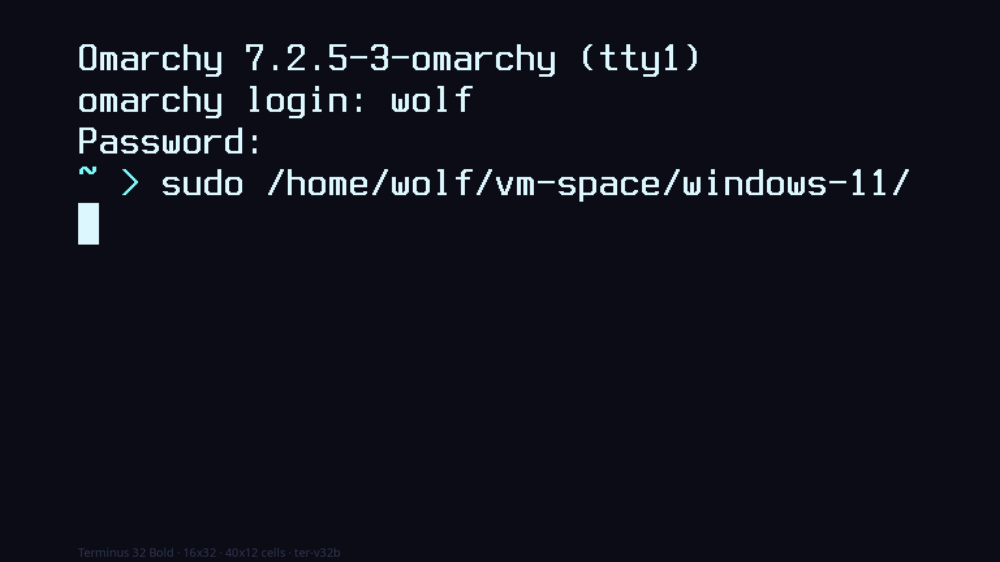
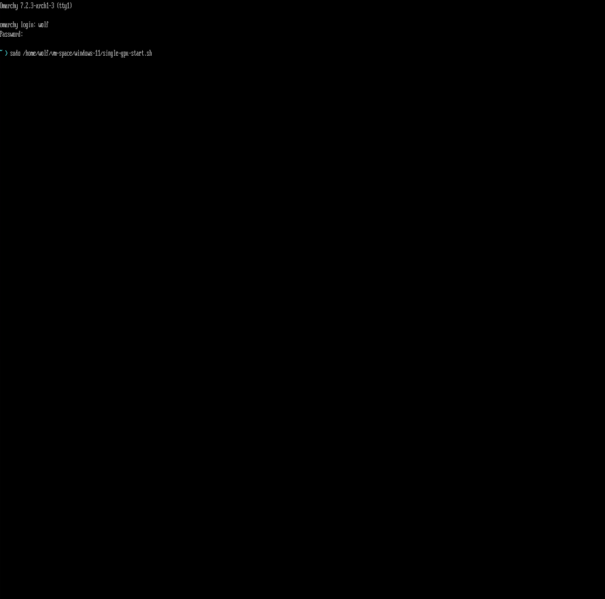
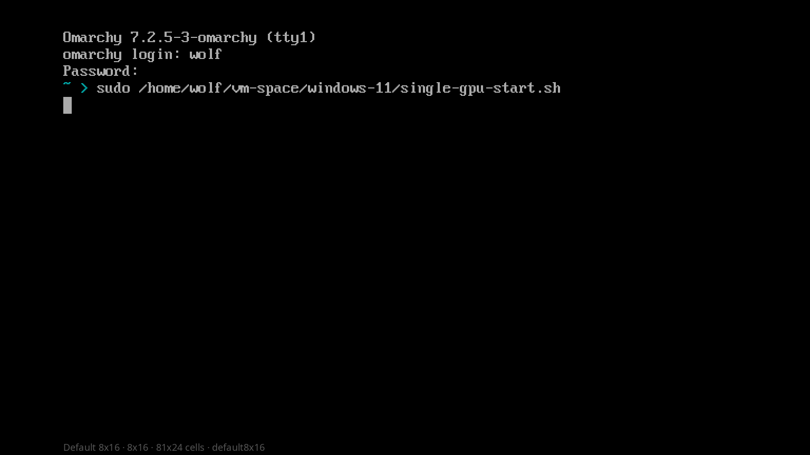

# OmaTTY

**Omarchy themes your desktop. OmaTTY picks the console font behind
Ctrl+Alt+F3 — real PSF mockups in the Style menu, then `FONT=` in
`/etc/vconsole.conf`.**



Built first for **accessibility** — low vision, a mostly-blind bastard who still
wants a usable virtual console, HiDPI / 1440p+ glass where `default8x16` is
squint-land, and reading kernel logs on Ctrl+Alt+F3 after the desktop has gone
away. Big fat Terminus clamps whip the TTY the way bitmap consoles used to.

**GPU passthrough / vm-curator:** when the card returns from a VM, fbcon often
resets to a tiny default *before* SDDM. `systemd-vconsole-setup` frequently
skips busy VTs (“All allocated virtual consoles are busy”). OmaTTY’s DRM
`card*` udev rule re-runs `setfont` from your `FONT=` on the **active** VT
(plus best-effort `setfont -C` on tty1–N — **no `chvt`**). That keeps SDDM’s
login VT alone so the greeter still works after a hop.

Observed on host after a few reboots and passthrough hops: **every getty ends
up fat and SDDM still comes up** — the active poke plus `-C` attempts are
enough in practice; a `chvt` sweep is not worth breaking the login path.
Other VTs may look small for a beat right after modeset; after settle / a
visit / the next boot they match. After a normal reboot, `vconsole.conf`
makes them all large from the start.

Opt-in only with the greeter **stopped** (nested VM / console-only tests):
`omatty reapply --all-vts` or `OMATTY_REAPPLY_ALL=1` (refused if SDDM /
a graphical session is up). Style → TTY Fonts / plain `omatty reapply` stay
SDDM-safe. Brief tiny flash mid-modeset is still possible.

**Pairing:** [OmaVT](https://github.com/AlxWolfenstein97/omavt) can retint the
console palette live when you hop to a TTY (kernel `vt.default_*` via a
limine-entry-tool drop-in — apply is a bit slow because it rebuilds Limine
entries for the *next* cold boot as well). Fat face here, theme colours there.

Stock Omarchy never sets a console font. Recent
[archinstall](https://github.com/archlinux/archinstall) builds expose a
**Console font** locales menu that lists every `*.gz` under
`/usr/share/kbd/consolefonts` (default `default8x16`, and Terminus when
`terminus-font` is around). Dumping that whole list into Style would be
hundreds of codepage relics and a uselessly huge carousel.

OmaTTY keeps a curated Terminus-first set, pulls `terminus-font` on install so
every tile is a **real** mockup (no “pick blind, install later” dance), and
applies with sudo the same way Style → Unlock / Boot Themes do.

## Goals (and honest limits)

These Style plugins extend Omarchy’s theme system **without requiring theme
authors — or you — to ship anything extra**. Fonts come from packages on the
machine (`kbd`, `terminus-font`); themes are not asked for font assets. The
broader “theme every surface that accepts colour data” story and stop-line
live in [Chroma](https://github.com/AlxWolfenstein97/chroma).

| Goal | What that means here |
|------|----------------------|
| Zero extra theme assets | No per-theme font previews. Glyphs come from installed PSF files. |
| Extreme compatibility | Works beside any Omarchy theme; pairs with [OmaVT](https://github.com/AlxWolfenstein97/omavt) for palette. |
| Closest-to-real mockups | Actual PSF bitmaps on a top-left getty session (same script as OmaVT). Still not a live `/dev/tty` capture. |
| Carousel-safe | Mockups are 1536×864 with ~8% side inset. Session stays top-left *inside* that margin; bigger faces crop mid-command like a real framebuffer. |
| Curated, not exhaustive | archinstall lists every console font; Style keeps a Terminus-first set so the picker stays usable. |
| Snappy pickers | Mockups warm in parallel across CPU cores and **skip tiles whose font / layout haven’t changed** — reopen is near-instant. On par with Omarchy’s stock Style carousels. |

### Why a Style picker for fonts?

Fonts are not theme colours — you are choosing a face/size, not syncing
`colors.toml`. The carousel still earns its keep the same way the theme
plugins do: mockups let you compare Terminus sizes across the curated set
faster than applying each one and hopping to Ctrl+Alt+F3. Pair with
[OmaVT](https://github.com/AlxWolfenstein97/omavt) when you want the TTY
*palette* to match the desktop too.

## What you get

- **Style → TTY Fonts** — labelled image picker (`omarchy-menu-images`).
- **Real PSF mockups** — top-left getty session painted with the font's own
  glyphs (not a lookalike TTF), so sizes read true before you apply.
- **Cropped like a TTY, not Hyprland** — fixed “glass”; bigger faces fit fewer
  columns/rows and **crop the content**. That is 1970s zoom (same framebuffer,
  hungrier cells), not compositor zoom that keeps layout and shrinks the
  viewport. Side effects on TUIs are real — fewer cells is fewer cells — and
  the mockup shows that on purpose (watch the passthrough path get eaten).
- **Every `ter-v*` weight the package ships** — 12–32, normal **and** bold
  (no `ter-v12b` upstream). `terminus-font` is installed up front.
- **Safe `vconsole.conf` patch** — only `FONT=` (inside `# omatty` markers).
  `KEYMAP` / XKB stay untouched.
- **TTY-safe Starship** — Omarchy’s desktop prompt glyphs will tofu on a
  bitmap console; OmaTTY ships a parallel profile for real `/dev/tty*` only.

## Mockups: shared session with OmaVT (real PSF paint)

Same getty script as [OmaVT](https://github.com/AlxWolfenstein97/omavt) — banner,
`wolf` login, `~ > sudo …/single-gpu-start.sh` — but every cell is a **real
console glyph** from the PSF you are picking. Layout from a QEMU default-TTY
capture (nested Omarchy, SDDM off → **tty1**; no GPU passthrough so F-keys stay
on the host). Paint stays on the **stock VGA Default** palette so the carousel
compares faces, not themes — [OmaVT](https://github.com/AlxWolfenstein97/omavt)
owns `colors.toml` → VT colour.

**Compare — real default TTY vs `default8x16` mockup (same face, VGA Default):**

| Real getty (QEMU, stock `default8x16` / tty1) | OmaTTY mockup (`default8x16`) |
| --- | --- |
|  |  |

Hero at the top is the same session on **Terminus 32 Bold** — the face the
carousel is selling for HiDPI glass (watch the path get eaten).

## Starship on a real TTY

Omarchy’s `starship.toml` is lovely under Nerd Fonts in Alacritty / Kitty /
Ghostty. On a PSF console those same glyphs are missing codepoints — tofu
blocks instead of a prompt:

| Desktop (Omarchy default) | TTY profile |
|---------------------------|-------------|
| `❯` success / `✗` error   | `>` / `x`   |
| `…/` truncation           | `.../`      |
| `⇡` `⇣` `⇕` git ahead/behind/diverged | `^` `v` `<>` |
| Nerd icons (`` `` ``)  | `!` `=` `*` |

OmaTTY writes `~/.config/omarchy/omatty/starship-tty.toml` and a marked block
in `~/.bashrc` that sets `STARSHIP_CONFIG` **only** when `tty` reports
`/dev/tty*` (Ctrl+Alt+F3 style). Graphical terminals keep the fancy profile.
Your Wayland session is untouched; the clamp only hits the virtual console.


## Marketplace consent (hooks & Style menu)

Installing the plugin only drops the code. Style menu rows and theme-set hooks
edit your Omarchy config, so they stay **opt-in**.

**Fast path (no prompts)** — from your home folder:

```sh
~/.config/omarchy/plugins/io.github.alxwolfenstein97.omatty/install.sh --yes
```

`--yes` means: I consent — arm everything this plugin supports, skip Y/n.
Style menu helper: `./tools/install-style-menu.sh --yes`.

**Arm the whole family in one shot** (after all plugins are installed):

```sh
~/.config/omarchy/plugins/io.github.alxwolfenstein97.chroma/tools/arm-all-family.sh
```

**Full wipe (this plugin)** — same ease as `install.sh --yes`
(teardown + `plugin remove`; skips optional pkg Y/n; pillow etc. stay):

```sh
~/.config/omarchy/plugins/io.github.alxwolfenstein97.omatty/uninstall.sh --yes
```

**Wipe the whole family** (calls each plugin’s `uninstall.sh --yes`):

```sh
~/.config/omarchy/plugins/io.github.alxwolfenstein97.chroma/tools/wipe-all-family.sh
```

Interactive `./install.sh` still asks [Y/n] if you prefer. Quiet shell restarts
only restore what you already armed. `./uninstall.sh` clears the arm flags.


## Install

```sh
omarchy plugin add https://github.com/AlxWolfenstein97/omatty.git --enable
```

That clones into `~/.config/omarchy/plugins/io.github.alxwolfenstein97.omatty`.
Or from a checkout:

```sh
~/.config/omarchy/plugins/io.github.alxwolfenstein97.omatty/install.sh
omarchy plugin enable io.github.alxwolfenstein97.omatty
```

**Needs (installer pulls these if missing):**

| Package | Why |
|---------|-----|
| `python-pillow` | Rasterises real PSF glyphs into Style → TTY Fonts tiles. Without it mockups fail and the carousel looks empty. |
| `terminus-font` | Terminus `ter-v*` console faces the curated picker shows. Without it those tiles cannot render. |

Also needs Omarchy’s image picker, `kbd` (`setfont`), and sudo for apply.
`install.sh` installs both packages **before** warming mockups. Same sudo story
as Chroma: interactive TTY can `omarchy pkg add` inline; shell-service `--quiet`
opens one floating terminal once when Terminus/Pillow are missing. Dismissed it?
`omarchy pkg add python-pillow terminus-font` then re-open Style → TTY Fonts
(or `omatty preview`). Mid-session enable: install refreshes the menu and
`rescanPlugins`; a shell restart also picks everything up.

**Font-menu side effect:** pulling `terminus-font` also registers Terminus under
Omarchy’s graphical **Fonts** menu (same class of package fallout as Courier New
showing up after you install `ttf-ms-fonts` for LibreOffice). Fine for the TTY —
a bad idea to pick for the desktop when Omarchy already runs JetBrains Mono Nerd
(and friends). Console face ≠ UI face; leave Style → Fonts alone for Terminus.

## How it works

1. `bin/omatty-switcher` renders PNGs into `~/.cache/omarchy/omatty/previews/`,
   busts the image-selector thumbnail cache, then opens `omarchy-menu-images`.
2. On selection, Style launches a floating terminal running `omatty-set`
   (same privilege pattern as Unlock): patches `/etc/vconsole.conf`, restarts
   `systemd-vconsole-setup`.
3. Install also drops the Starship TTY profile + bashrc snippet.

CLI:

```sh
omatty list
omatty preview              # warm all mockups
omatty switcher             # picker → prints font id
omatty show ter-v32b        # print patched vconsole.conf
omatty set ter-v32b         # apply (sudo)
omatty set ter-v32b --dry-run
omatty reapply              # setfont again from current FONT= (sudo; active VT)
omatty reapply --all-vts    # optional chvt sweep — only with SDDM stopped
omatty clear                # drop FONT=, live default8x16, refresh initramfs (sudo)
omatty current
```

Encrypted installs bake `FONT=` into the initramfs (`consolefont` / Plymouth). `omatty set` and `omatty clear` run `limine-mkinitcpio` afterward so the LUKS prompt and early TTY match — leave the floater open until that finishes.

Want even larger glyphs on a live console without changing `FONT=`? `setfont -d`
doubles whatever face is loaded (horizontal + vertical).

Install does **not** force the DRM udev rule — optional for single-GPU / VFIO
hops only. The package floater asks y/N in the **same** window as Pillow/Terminus
(default No; Done closes normally). Arm later anytime:

```sh
omatty install-drm
# or: ~/.config/omarchy/plugins/io.github.alxwolfenstein97.omatty/install.sh --with-drm-reapply
```

## Fresh VM smoke test

```sh
omarchy plugin add https://github.com/AlxWolfenstein97/omatty.git --enable
# Floater: pillow + terminus (scanned); optional DRM y/N in the same window (default N)
# Style → TTY Fonts appears without a shell restart
# Pick ter-v32b → floater runs limine-mkinitcpio; Ctrl+Alt+F3 fat; reboot → LUKS/early TTY fat too
omatty current
omatty reapply   # sudo — same helper udev uses (active VT; SDDM-safe)

# Optional VFIO path:
#   omatty install-drm
#   ls /etc/udev/rules.d/99-omatty-reapply.rules /usr/local/lib/omatty/reapply

# Skip install floater → logout/reboot → one floater again (shell restart does not re-nag)
# ./uninstall.sh → floater: udev off, clear FONT=, setfont default8x16, limine-mkinitcpio, optional pkg drop
#   reboot → unlock + TTY back to stock size (encrypted and plain)
# Skip remove floater + disable → reinstall → uninstall again → go through floater once
# Pillow drop with mangohud/goverlay installed → fails Required By; that is fine
```

## Disable vs remove

| Action | What happens |
|--------|----------------|
| `omarchy plugin disable …` | Shell service stops. No theme-set hook — last `FONT=` / DRM reapply udev stay. |
| `./uninstall.sh` then disable / remove | Menu, bashrc snippet, config/cache/state gone. Floater drops DRM udev first, then `omatty clear` (strips `FONT=`, live `setfont default8x16`, then `limine-mkinitcpio` so encrypted/LUKS early boot is not stuck on fat Terminus baked into the initramfs). Optional y/N `pkg drop`. |
| `omarchy pkg drop python-pillow` | Optional. Only if nothing else needs Pillow. Offered in the uninstall floater. |
| `omarchy pkg drop terminus-font` | Optional. Only if you no longer want Terminus console faces. |

Quiet Service install (`--quiet`): **no package floaters** — restores already-armed
wiring only (DRM udev only if already passwordless). Deps + Style consent + DRM
reapply come from interactive `install.sh`, `--yes --with-drm-reapply`, or family
`arm-all-family.sh`. Menu + `rescanPlugins` so Style → TTY Fonts shows without a
manual shell restart.

**Full wipe** — one shot (`--yes` skips pkg Y/n and removes the plugin):

```sh
~/.config/omarchy/plugins/io.github.alxwolfenstein97.omatty/uninstall.sh --yes
```

## Why not every console font?

archinstall’s Console font menu is exhaustive on purpose. For a Style carousel we
only keep faces you can tell apart at a glance: the Arch default, two useful kbd
fonts, and every Terminus Unicode size/weight the package ships — not a full
archinstall clone, just the part that earns its keep. Mockups warm in parallel
across CPU cores and **skip tiles whose font / layout haven’t changed** — same
snappy reopen as the other Style extenders.

## Check

```sh
bash ~/.config/omarchy/plugins/io.github.alxwolfenstein97.omatty/check.sh
```

## Credits

- **Layout reference:** [`reference-tty-default.png`](reference-tty-default.png)
  — QEMU getty on tty1 (SDDM off in a nested Omarchy VM). Same session script as
  OmaVT; this plugin paints it with real PSF glyphs on **VGA Default** (palette
  theming is OmaVT’s job). Compare mockup (same stock face):
  [`preview-default8x16.png`](preview-default8x16.png). Hero:
  **Terminus 32 Bold** ([`preview.png`](preview.png)).
- Sibling Style plugins: [OmaBoot](https://github.com/AlxWolfenstein97/omaboot),
  [OmaVT](https://github.com/AlxWolfenstein97/omavt),
  [OmaOBS](https://github.com/AlxWolfenstein97/omaobs),
  [OmaCursor](https://github.com/AlxWolfenstein97/omacursor),
  [OmaHud](https://github.com/AlxWolfenstein97/omahud),
  [Chroma](https://github.com/AlxWolfenstein97/chroma).
- [archinstall](https://github.com/archlinux/archinstall) Console font menu —
  inspiration for surfacing Terminus sizes without dumping every `*.gz`.
- [Omarchy](https://omarchy.org/) — Style menu image picker and floating-terminal
  sudo pattern.

## License

MIT — see [LICENSE](LICENSE).
